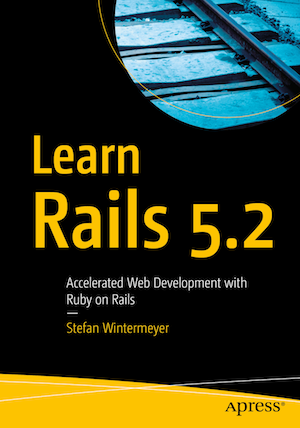

[](https://gitpitch.com/enogrob/ebook-project/master)
```
Roberto Nogueira
BSd EE, MSd CE
Solution Integrator Experienced - Certified by Ericsson
```
# eBook Learn Rails 5.2



**About**

Learn everything you need to about the subject of this `eBook` project.

[Homepage](https://www.apress.com/us/book/9781484234884)

## Topics
```
01. Ruby Introduction
[x] Ruby 2.5
[x] Basics
[x] Ruby is Object-Oriented
[x] Basic Classes
[x] Variables
[x] Methods Once Again
[x] if Condition
[x] Loops
[x] Arrays and Hashes
[x] Range
02. First Steps with Rails
[x] Environment (Development)
[x] SQLite3 Database
[x] Why Is It All in English?
[x] Static Content (HTML and Graphics Files)
[x] Creating HTML Dynamically with erb
[x] The Rails Console
[x] What Is a Generator?
[x] Helper
[x] Debugging
[x] Rails Lingo
[x] Model View Controller Architecture
[x] Abbreviations
03. ActiveRecord
[x] Creating a Database/Model
[x] Adding Records
[x] first, last, and all
[x] Populating the Database with seeds.rb
[x] Searching and Finding with Queries
[x] Calculations
[x] SQL EXPLAIN
[x] Batches
[x] Editing a Record
[x] has_many Association
[x] Many-to-Many, an n:n Association
[x] Polymorphic Associations
[x] Deleting/Destroying a Record
[x] Transactions
[x] Scopes
[x] Validation
[x] Migrations
[x] Callbacks
[x] Default Values
04. Scaffolding and REST
[x] Redirects and Flash Messages
[x] Generating a Scaffold
[x] When Should you use Scaffolding?
05. Routes
[x] HTTP GET Requests for Singular Resources
[x] root:to => "welcome#index"
[x] resources
[x] Further Information on Routes
06. Bundler and Gems
[ ] bundle update
[ ] bundle outdated
[ ] bundle exec
[ ] binstubs
[ ] Popular Gems
[ ] Further Information on Bundler
07. Forms
[ ] The Data-Input Workflow
[ ] Generic Forms
[ ] FormTagHelper
[ ] Alternatives
08. Cookies and Sessions
[ ] Cookies
[ ] Sessions
09. Tests
[ ] Example for a User in a Web Shop
[ ] Fixtures
[ ] Integration Tests
[ ] rails stats
[ ] More on Testing
10. Active Job
[ ] Create a New Job
[ ] Set the Time for Future Execution
[ ] Configure the Job Server Back End
11. Action Mailer
[ ] Configuring the E-mail Server
[ ] Custom X-Header
[ ] Attachments
[ ] Further information
12. Internationalization
[ ] I18n.t
[ ] Localized Views
[ ] A Rails Application in Only One Language
[ ] Paths in German
[ ] Multilingual Rails Applications
[ ] Using I18n.locate for Defining the Default Language
[ ] Multilingual Scaffold Example
[ ] Further information
13. Asset Pipeline
[ ] application.js
[ ] application.css
[ ] rails assets:precompile
[ ] The Fingerprint
[ ] Conding Links to a Asset
[ ] Coding a Link to a image
[ ] Coding a Link to a JavaScript File
[ ] Coding a Link to a CSS File
[ ] Defaults in application.html.erb
14. Caching
[ ] The Example Application
[ ] HTTP Caching
[ ] Fragment Caching
[ ] Page Caching
[ ] Preheating
[ ] Further information
15. Action Cable
[ ] Hello World Action Cable Example
16. Credentials
[ ] Setup
[ ] Editing Credentials
[ ] Accessing a Key
[ ] Using the Credentials on the Production Web Server
17. Active Storage
[ ] Avatar Example
Appendix A:Ruby on Rails Installation
Appendix B:Web Server in Production Mode
Appendix C:Futher Rails Reading Material
```
